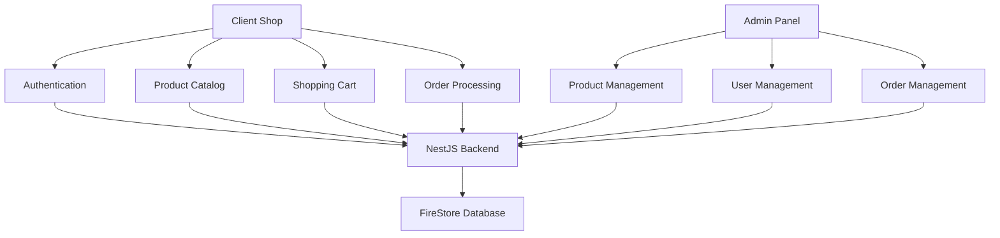

# NestJS Backend with FireStore Integration - Analysis & Implementation Plan

## Executive Summary

This document provides a comprehensive analysis of the current frontend-backend integration points in the Shoestore Workspace, with the goal of designing and implementing a production-ready NestJS backend using FireStore as the database. The analysis covers both client-shop (B2B customer app) and admin-panel applications, ensuring a unified backend architecture that supports role-based access control and optimal performance on Vercel.

## Table of Contents

1. [Current Frontend-Backend Integration Points](#1-current-frontend-backend-integration-points)
2. [Firebase 2025 Best Practices for Vercel](#2-firebase-2025-best-practices-for-vercel)
3. [FireStore Database Schema Design](#3-firestore-database-schema-design)
4. [NestJS Services Architecture](#4-nestjs-services-architecture)
5. [Authentication & Authorization](#5-authentication--authorization)
6. [Migration Strategy](#6-migration-strategy)
7. [Implementation Milestones](#7-implementation-milestones)

---

## 1. Current Frontend-Backend Integration Points

### 1.1 Client Shop Application

#### Authentication Services
**Location**: `apps/client-shop/src/app/core/services/auth-api.service.ts`

**Integration Points**:
- `login(credentials)` - User authentication with email/password
- `requestPasswordReset(email)` - Password reset flow
- `requestAccess(request)` - B2B account registration
- `validateSession()` - Session/token validation
- `changePassword(request)` - Password updates
- `changeEmail(request)` - Email updates
- `updateAddresses(request)` - Billing/shipping address updates

**Current Implementation**: Mock service with localStorage persistence

#### Product Catalog Services
**Location**: `apps/client-shop/src/app/shared/services/product-api.service.ts`

**Integration Points**:
- `getProducts(filters)` - Product listing with search, category, and brand filters
- `getProductById(id)` - Single product details
- `getProductsByCategory(category)` - Category-based filtering
- `getSizeTemplates()` - Size conversion tables
- `checkAvailability(productId, size)` - Stock validation

**Current Implementation**: Mock data with static product arrays

#### Shopping Cart Services
**Location**: `apps/client-shop/src/app/features/cart/services/cart-api.service.ts`

**Integration Points**:
- `removeItem(request)` - Remove items from cart
- `updateItemQuantity(request)` - Update quantities with stock validation
- `validateStock(request)` - Bulk stock validation before checkout
- `submitOrder(request)` - Order submission
- `reserveItems(request)` - Temporary stock reservation
- `releaseReservation(reservationId)` - Release reserved stock
- `calculateShipping(request)` - Shipping cost calculation

**Current Implementation**: Mock service with simulated stock conflicts

#### Order Management Services
**Location**: `apps/client-shop/src/app/features/orders/services/`

**Order Submission** (`order-api.service.ts`):
- `submitOrder(request)` - Complete order processing
- `getOrderDetails(orderId)` - Retrieve order details
- `updateOrderStatus(orderId, status)` - Status updates
- `validateOrderAccess(orderId, userId)` - Access control
- `getUserOrders(userId)` - User's order history
- `reserveStock(items)` - Stock reservation
- `releaseStockReservation(reservationId)` - Release reservations

**Order History** (`order-history-api.service.ts`):
- `getOrders(params)` - Paginated order history with filtering
- `getOrderById(id)` - Single order details

**Current Implementation**: Mock services with localStorage persistence

### 1.2 Admin Panel Application

#### Shoe Management Services
**Location**: `apps/admin-panel/src/app/pages/shoes/service/shoe.service.ts`

**Integration Points**:
- `getShoes(params)` - Paginated product listing with filters and sorting
- `getShoeById(id)` - Single product details
- `createShoe(dto)` - Create new products with image upload
- `updateShoe(id, dto)` - Update existing products
- `deleteShoe(id)` - Soft delete products
- `bulkUpdateStock(dto)` - Bulk stock adjustments

**Current Implementation**: Mock service simulating HTTP operations

#### User Management Services
**Location**: `apps/admin-panel/src/app/pages/users/services/user.service.ts`

**Integration Points**:
- `getUsers(params)` - Paginated B2B customer listing
- `getAllUsers()` - Complete user list for autocomplete
- `getUserById(id)` - Single user details

**Current Implementation**: HTTP service pointing to `/api/users`

#### Order Management Services
**Location**: `apps/admin-panel/src/app/pages/orders/services/order.service.ts`

**Integration Points**:
- `getOrders(params)` - Paginated order listing with filters
- `getOrderById(id)` - Order details with customer info
- `createOrder(dto)` - Manual order creation
- `updateOrderStatus(id, dto)` - Order status management

**Current Implementation**: HTTP service pointing to `/api/orders`

### 1.3 Data Flow Summary



---

## 2. Firebase 2025 Best Practices for Vercel

### 2.1 Optimal Configuration for Vercel Serverless

Based on Firebase 2025 documentation and Vercel's serverless architecture:

#### Connection Management
- **Connection Pooling**: Use Firebase Admin SDK connection pooling
- **Persistent Connections**: Leverage Vercel's connection reuse across invocations
- **Regional Deployment**: Deploy FireStore in the same region as Vercel functions

#### Performance Optimization
```typescript
// Recommended Firebase Admin configuration for Vercel
import { initializeApp, getApps } from 'firebase-admin/app';
import { getFirestore } from 'firebase-admin/firestore';

const app = getApps().length === 0 ? initializeApp({
  projectId: process.env.FIREBASE_PROJECT_ID,
  // Use service account for admin operations
}) : getApps()[0];

const db = getFirestore(app);

// Configure for optimal performance
db.settings({
  ignoreUndefinedProperties: true,
  maxIdleChannels: 10,
  maxIdleTime: 300000, // 5 minutes
});
```

### 2.2 Request Optimization Strategies

#### Batch Operations
- Use FireStore batch writes for multiple operations
- Implement batch reads for related data
- Bundle cart operations into single transactions

#### Caching Strategy
```typescript
// Implement intelligent caching
const CACHE_DURATIONS = {
  products: 3600, // 1 hour
  sizeTemplates: 86400, // 24 hours
  userSessions: 1800, // 30 minutes
};
```

#### Query Optimization
- Use composite indexes for complex queries
- Implement pagination with cursors
- Minimize document reads with field selection

### 2.3 Security Rules for Production

```javascript
// FireStore Security Rules
rules_version = '2';
service cloud.firestore {
  match /databases/{database}/documents {
    // Users can only access their own data
    match /users/{userId} {
      allow read, write: if request.auth != null && request.auth.uid == userId;
    }
    
    // Products are publicly readable, admin writable
    match /products/{productId} {
      allow read: if true;
      allow write: if request.auth != null && 
        get(/databases/$(database)/documents/users/$(request.auth.uid)).data.role == 'admin';
    }
    
    // Orders are user-specific
    match /orders/{orderId} {
      allow read, write: if request.auth != null && 
        (resource.data.userId == request.auth.uid || 
         get(/databases/$(database)/documents/users/$(request.auth.uid)).data.role == 'admin');
    }
    
    // Cart operations
    match /carts/{userId} {
      allow read, write: if request.auth != null && request.auth.uid == userId;
    }
  }
}
```

---

## 3. FireStore Database Schema Design

### 3.1 Users Collection

```typescript
interface UserDocument {
  id: string; // Document ID matches Auth UID
  email: string;
  contactName: string;
  phone: string;
  role: 'customer' | 'admin';
  
  // Address information
  shippingAddress: {
    street: string;
    city: string;
    postalCode: string;
    country: string;
  };
  
  billingAddress: {
    street: string;
    city: string;
    postalCode: string;
    country: string;
  };
  
  // Business information
  invoiceInfo: {
    companyName: string;
    vatNumber: string;
  };
  
  // Account management
  isActive: boolean;
  emailVerified: boolean;
  
  // Timestamps
  createdAt: Timestamp;
  updatedAt: Timestamp;
  lastLoginAt?: Timestamp;
}
```

### 3.2 Products Collection

```typescript
interface ProductDocument {
  id: string;
  code: string; // Unique product code
  name: string;
  description?: string;
  imageUrl?: string;
  
  // Categorization
  category: string; // 'sneakers', 'boots', 'dress', etc.
  brand?: string;
  tags: string[];
  
  // Visibility and status
  visible: boolean;
  isActive: boolean;
  
  // Size template reference
  templateId: string;
  
  // Pricing and inventory (embedded for performance)
  sizes: {
    [sizeNumber: string]: {
      price: number;
      quantity: number;
      reserved: number; // For cart reservations
    };
  };
  
  // SEO and search
  searchKeywords: string[];
  
  // Timestamps
  createdAt: Timestamp;
  updatedAt: Timestamp;
  createdBy: string; // Admin user ID
}
```

### 3.3 Size Templates Collection

```typescript
interface SizeTemplateDocument {
  id: string;
  name: string; // 'EU Standard', 'UK Standard', etc.
  description?: string;
  
  conversions: {
    eu: number;
    us: number;
    uk?: number;
    cm?: number;
  }[];
  
  isActive: boolean;
  createdAt: Timestamp;
  updatedAt: Timestamp;
}
```

### 3.4 Orders Collection

```typescript
interface OrderDocument {
  id: string; // Auto-generated order ID
  orderNumber: string; // Human-readable order number
  
  // Customer information
  userId: string;
  
  // Order details
  status: 'pending' | 'confirmed' | 'processing' | 'shipped' | 'delivered' | 'cancelled';
  
  items: {
    productId: string;
    productCode: string;
    productName: string;
    size: number;
    quantity: number;
    unitPrice: number;
    totalPrice: number;
  }[];
  
  // Pricing
  subtotal: number;
  shippingCost: number;
  taxAmount: number;
  totalAmount: number;
  
  // Payment information
  paymentMethod: 'bank_transfer' | 'credit_card';
  paymentStatus: 'pending' | 'paid' | 'failed' | 'refunded';
  paymentReference?: string;
  
  // Shipping information
  shippingAddress: {
    street: string;
    city: string;
    postalCode: string;
    country: string;
  };
  
  billingAddress: {
    street: string;
    city: string;
    postalCode: string;
    country: string;
  };
  
  // Business information
  invoiceInfo: {
    companyName: string;
    vatNumber: string;
  };
  
  // Tracking and notes
  trackingNumber?: string;
  notes?: string;
  adminNotes?: string;
  
  // Timestamps
  createdAt: Timestamp;
  updatedAt: Timestamp;
  shippedAt?: Timestamp;
  deliveredAt?: Timestamp;
}
```

### 3.5 Carts Collection (Session Management)

```typescript
interface CartDocument {
  id: string; // User ID
  
  items: {
    productId: string;
    productCode: string;
    productName: string;
    size: number;
    quantity: number;
    unitPrice: number;
    addedAt: Timestamp;
    
    // Temporary reservation
    reservationId?: string;
    reservedUntil?: Timestamp;
  }[];
  
  // Cart metadata
  updatedAt: Timestamp;
  expiresAt: Timestamp; // Auto-cleanup after inactivity
}
```

### 3.6 Stock Reservations Collection

```typescript
interface StockReservationDocument {
  id: string; // Auto-generated reservation ID
  
  userId: string;
  items: {
    productId: string;
    size: number;
    quantity: number;
  }[];
  
  // Reservation management
  status: 'active' | 'released' | 'consumed';
  expiresAt: Timestamp;
  
  createdAt: Timestamp;
  updatedAt: Timestamp;
}
```

### 3.7 Composite Indexes Required

```typescript
// Required FireStore composite indexes
const REQUIRED_INDEXES = [
  // Products
  { collection: 'products', fields: ['visible', 'category', 'createdAt'] },
  { collection: 'products', fields: ['visible', 'searchKeywords', 'createdAt'] },
  { collection: 'products', fields: ['isActive', 'brand', 'createdAt'] },
  
  // Orders
  { collection: 'orders', fields: ['userId', 'status', 'createdAt'] },
  { collection: 'orders', fields: ['status', 'createdAt'] },
  { collection: 'orders', fields: ['orderNumber', 'createdAt'] },
  
  // Users
  { collection: 'users', fields: ['role', 'isActive', 'createdAt'] },
  { collection: 'users', fields: ['email', 'isActive'] },
  
  // Stock Reservations
  { collection: 'stockReservations', fields: ['userId', 'status', 'expiresAt'] },
  { collection: 'stockReservations', fields: ['status', 'expiresAt'] },
];
```

---

## 4. NestJS Services Architecture

### 4.1 Module Structure

```
src/
├── app.module.ts
├── auth/
│   ├── auth.module.ts
│   ├── auth.service.ts
│   ├── auth.controller.ts
│   ├── guards/
│   │   ├── jwt-auth.guard.ts
│   │   └── roles.guard.ts
│   └── strategies/
│       └── jwt.strategy.ts
├── users/
│   ├── users.module.ts
│   ├── users.service.ts
│   ├── users.controller.ts
│   └── dto/
├── products/
│   ├── products.module.ts
│   ├── products.service.ts
│   ├── products.controller.ts
│   └── dto/
├── orders/
│   ├── orders.module.ts
│   ├── orders.service.ts
│   ├── orders.controller.ts
│   └── dto/
├── cart/
│   ├── cart.module.ts
│   ├── cart.service.ts
│   ├── cart.controller.ts
│   └── dto/
├── common/
│   ├── decorators/
│   ├── filters/
│   ├── interceptors/
│   └── pipes/
└── firebase/
    ├── firebase.module.ts
    └── firebase.service.ts
```

### 4.2 Core Services Implementation

#### Firebase Service (Base)
```typescript
@Injectable()
export class FirebaseService {
  private readonly db: Firestore;
  
  constructor() {
    const app = getApps().length === 0 ? initializeApp({
      projectId: process.env.FIREBASE_PROJECT_ID,
    }) : getApps()[0];
    
    this.db = getFirestore(app);
  }
  
  getCollection(path: string) {
    return this.db.collection(path);
  }
  
  async batchWrite(operations: any[]) {
    const batch = this.db.batch();
    operations.forEach(op => {
      switch (op.type) {
        case 'create':
          batch.create(op.ref, op.data);
          break;
        case 'update':
          batch.update(op.ref, op.data);
          break;
        case 'delete':
          batch.delete(op.ref);
          break;
      }
    });
    return batch.commit();
  }
}
```

#### Products Service
```typescript
@Injectable()
export class ProductsService {
  constructor(private firebaseService: FirebaseService) {}
  
  async findAll(query: ProductQueryDto): Promise<PagedResult<Product>> {
    const productsRef = this.firebaseService.getCollection('products');
    let firestoreQuery = productsRef.where('visible', '==', true);
    
    // Apply filters
    if (query.category) {
      firestoreQuery = firestoreQuery.where('category', '==', query.category);
    }
    
    if (query.search) {
      // Use array-contains for search keywords
      firestoreQuery = firestoreQuery.where('searchKeywords', 'array-contains', query.search.toLowerCase());
    }
    
    // Apply sorting
    firestoreQuery = firestoreQuery.orderBy('createdAt', query.sortDirection || 'desc');
    
    // Apply pagination
    if (query.page && query.pageSize) {
      const offset = (query.page - 1) * query.pageSize;
      firestoreQuery = firestoreQuery.limit(query.pageSize).offset(offset);
    }
    
    const snapshot = await firestoreQuery.get();
    const items = snapshot.docs.map(doc => ({ id: doc.id, ...doc.data() }));
    
    // Get total count for pagination
    const totalSnapshot = await productsRef.where('visible', '==', true).count().get();
    
    return {
      items,
      total: totalSnapshot.data().count,
      page: query.page || 1,
      pageSize: query.pageSize || 10,
    };
  }
  
  async updateStock(productId: string, size: number, quantityDelta: number): Promise<void> {
    const productRef = this.firebaseService.getCollection('products').doc(productId);
    
    return this.firebaseService.db.runTransaction(async (transaction) => {
      const doc = await transaction.get(productRef);
      if (!doc.exists) {
        throw new NotFoundException('Product not found');
      }
      
      const product = doc.data();
      const currentQuantity = product.sizes[size]?.quantity || 0;
      const newQuantity = Math.max(0, currentQuantity + quantityDelta);
      
      transaction.update(productRef, {
        [`sizes.${size}.quantity`]: newQuantity,
        updatedAt: FieldValue.serverTimestamp(),
      });
    });
  }
}
```

#### Cart Service
```typescript
@Injectable()
export class CartService {
  constructor(private firebaseService: FirebaseService) {}
  
  async addToCart(userId: string, item: AddToCartDto): Promise<void> {
    const cartRef = this.firebaseService.getCollection('carts').doc(userId);
    
    return this.firebaseService.db.runTransaction(async (transaction) => {
      const cartDoc = await transaction.get(cartRef);
      const cart = cartDoc.exists ? cartDoc.data() : { items: [] };
      
      // Check if item already exists
      const existingItemIndex = cart.items.findIndex(
        (cartItem: any) => cartItem.productId === item.productId && cartItem.size === item.size
      );
      
      if (existingItemIndex >= 0) {
        // Update quantity
        cart.items[existingItemIndex].quantity += item.quantity;
      } else {
        // Add new item
        cart.items.push({
          ...item,
          addedAt: FieldValue.serverTimestamp(),
        });
      }
      
      transaction.set(cartRef, {
        ...cart,
        updatedAt: FieldValue.serverTimestamp(),
        expiresAt: new Date(Date.now() + 7 * 24 * 60 * 60 * 1000), // 7 days
      });
    });
  }
  
  async validateAndReserveStock(userId: string): Promise<string> {
    const cartRef = this.firebaseService.getCollection('carts').doc(userId);
    const cartDoc = await cartRef.get();
    
    if (!cartDoc.exists) {
      throw new BadRequestException('Cart not found');
    }
    
    const cart = cartDoc.data();
    const reservationId = `res_${Date.now()}_${Math.random().toString(36).substr(2, 9)}`;
    
    // Validate stock and create reservation
    return this.firebaseService.db.runTransaction(async (transaction) => {
      const conflicts: any[] = [];
      
      // Check stock availability
      for (const item of cart.items) {
        const productRef = this.firebaseService.getCollection('products').doc(item.productId);
        const productDoc = await transaction.get(productRef);
        
        if (!productDoc.exists) {
          conflicts.push({ productId: item.productId, reason: 'Product not found' });
          continue;
        }
        
        const product = productDoc.data();
        const availableQuantity = product.sizes[item.size]?.quantity || 0;
        
        if (availableQuantity < item.quantity) {
          conflicts.push({
            productId: item.productId,
            size: item.size,
            requestedQuantity: item.quantity,
            availableStock: availableQuantity,
          });
        }
      }
      
      if (conflicts.length > 0) {
        throw new BadRequestException({ message: 'Stock conflicts detected', conflicts });
      }
      
      // Create reservation
      const reservationRef = this.firebaseService.getCollection('stockReservations').doc(reservationId);
      transaction.set(reservationRef, {
        userId,
        items: cart.items.map(item => ({
          productId: item.productId,
          size: item.size,
          quantity: item.quantity,
        })),
        status: 'active',
        expiresAt: new Date(Date.now() + 15 * 60 * 1000), // 15 minutes
        createdAt: FieldValue.serverTimestamp(),
        updatedAt: FieldValue.serverTimestamp(),
      });
      
      // Reserve stock
      for (const item of cart.items) {
        const productRef = this.firebaseService.getCollection('products').doc(item.productId);
        transaction.update(productRef, {
          [`sizes.${item.size}.reserved`]: FieldValue.increment(item.quantity),
        });
      }
      
      return reservationId;
    });
  }
}
```

#### Orders Service
```typescript
@Injectable()
export class OrdersService {
  constructor(
    private firebaseService: FirebaseService,
    private cartService: CartService,
  ) {}
  
  async createOrder(userId: string, createOrderDto: CreateOrderDto): Promise<Order> {
    const orderNumber = this.generateOrderNumber();
    const orderId = `order_${Date.now()}_${Math.random().toString(36).substr(2, 6)}`;
    
    return this.firebaseService.db.runTransaction(async (transaction) => {
      // Get user data
      const userRef = this.firebaseService.getCollection('users').doc(userId);
      const userDoc = await transaction.get(userRef);
      
      if (!userDoc.exists) {
        throw new NotFoundException('User not found');
      }
      
      const user = userDoc.data();
      
      // Calculate totals
      const subtotal = createOrderDto.items.reduce((sum, item) => sum + item.totalPrice, 0);
      const shippingCost = this.calculateShipping(createOrderDto.items, user);
      const taxAmount = this.calculateTax(subtotal, user);
      const totalAmount = subtotal + shippingCost + taxAmount;
      
      // Create order
      const orderRef = this.firebaseService.getCollection('orders').doc(orderId);
      const orderData = {
        orderNumber,
        userId,
        status: 'pending',
        items: createOrderDto.items,
        subtotal,
        shippingCost,
        taxAmount,
        totalAmount,
        paymentMethod: createOrderDto.paymentMethod || 'bank_transfer',
        paymentStatus: 'pending',
        shippingAddress: user.shippingAddress,
        billingAddress: user.billingAddress,
        invoiceInfo: user.invoiceInfo,
        createdAt: FieldValue.serverTimestamp(),
        updatedAt: FieldValue.serverTimestamp(),
      };
      
      transaction.set(orderRef, orderData);
      
      // Consume stock reservation if exists
      if (createOrderDto.reservationId) {
        const reservationRef = this.firebaseService.getCollection('stockReservations').doc(createOrderDto.reservationId);
        transaction.update(reservationRef, {
          status: 'consumed',
          updatedAt: FieldValue.serverTimestamp(),
        });
      }
      
      // Update actual stock
      for (const item of createOrderDto.items) {
        const productRef = this.firebaseService.getCollection('products').doc(item.productId);
        transaction.update(productRef, {
          [`sizes.${item.size}.quantity`]: FieldValue.increment(-item.quantity),
          [`sizes.${item.size}.reserved`]: FieldValue.increment(-item.quantity),
        });
      }
      
      // Clear cart
      const cartRef = this.firebaseService.getCollection('carts').doc(userId);
      transaction.delete(cartRef);
      
      return { id: orderId, ...orderData } as Order;
    });
  }
  
  private generateOrderNumber(): string {
    const date = new Date();
    const year = date.getFullYear().toString().slice(-2);
    const month = (date.getMonth() + 1).toString().padStart(2, '0');
    const day = date.getDate().toString().padStart(2, '0');
    const random = Math.floor(Math.random() * 1000).toString().padStart(3, '0');
    
    return `ORD${year}${month}${day}${random}`;
  }
}
```

---

## 5. Authentication & Authorization

### 5.1 Firebase Authentication Integration

#### JWT Strategy with Firebase ID Tokens
```typescript
@Injectable()
export class JwtStrategy extends PassportStrategy(Strategy) {
  constructor() {
    super({
      jwtFromRequest: ExtractJwt.fromAuthHeaderAsBearerToken(),
      ignoreExpiration: false,
      secretOrKey: process.env.JWT_SECRET,
    });
  }
  
  async validate(payload: any) {
    // Verify Firebase ID token
    const decodedToken = await admin.auth().verifyIdToken(payload.token);
    
    // Get user from FireStore
    const userDoc = await admin.firestore().collection('users').doc(decodedToken.uid).get();
    
    if (!userDoc.exists) {
      throw new UnauthorizedException('User not found');
    }
    
    return { ...userDoc.data(), uid: decodedToken.uid };
  }
}
```

#### Role-Based Guard
```typescript
@Injectable()
export class RolesGuard implements CanActivate {
  constructor(private reflector: Reflector) {}
  
  canActivate(context: ExecutionContext): boolean {
    const requiredRoles = this.reflector.getAllAndOverride<string[]>('roles', [
      context.getHandler(),
      context.getClass(),
    ]);
    
    if (!requiredRoles) {
      return true;
    }
    
    const request = context.switchToHttp().getRequest();
    const user = request.user;
    
    return requiredRoles.some((role) => user?.role === role);
  }
}
```

#### Custom Decorators
```typescript
export const Roles = (...roles: string[]) => SetMetadata('roles', roles);

export const GetUser = createParamDecorator(
  (data: unknown, ctx: ExecutionContext) => {
    const request = ctx.switchToHttp().getRequest();
    return request.user;
  },
);
```

### 5.2 Authorization Patterns

#### Controller Implementation
```typescript
@Controller('products')
@UseGuards(JwtAuthGuard)
export class ProductsController {
  constructor(private productsService: ProductsService) {}
  
  @Get()
  @Public() // Products are publicly readable
  async findAll(@Query() query: ProductQueryDto) {
    return this.productsService.findAll(query);
  }
  
  @Post()
  @Roles('admin')
  @UseGuards(RolesGuard)
  async create(@Body() createProductDto: CreateProductDto, @GetUser() user: any) {
    return this.productsService.create(createProductDto, user.uid);
  }
  
  @Patch(':id/stock')
  @Roles('admin')
  @UseGuards(RolesGuard)
  async updateStock(@Param('id') id: string, @Body() updateStockDto: UpdateStockDto) {
    return this.productsService.updateStock(id, updateStockDto.size, updateStockDto.quantityDelta);
  }
}

@Controller('orders')
@UseGuards(JwtAuthGuard)
export class OrdersController {
  constructor(private ordersService: OrdersService) {}
  
  @Get()
  async findUserOrders(@GetUser() user: any, @Query() query: OrderQueryDto) {
    if (user.role === 'admin') {
      return this.ordersService.findAll(query);
    }
    return this.ordersService.findByUserId(user.uid, query);
  }
  
  @Post()
  async create(@GetUser() user: any, @Body() createOrderDto: CreateOrderDto) {
    return this.ordersService.createOrder(user.uid, createOrderDto);
  }
  
  @Patch(':id/status')
  @Roles('admin')
  @UseGuards(RolesGuard)
  async updateStatus(@Param('id') id: string, @Body() updateStatusDto: UpdateOrderStatusDto) {
    return this.ordersService.updateStatus(id, updateStatusDto.status);
  }
}
```

---

## 6. Migration Strategy

### 6.1 Migration Phases

#### Phase 1: Infrastructure Setup (Week 1)
1. **Firebase Project Setup**
   - Create Firebase project with FireStore enabled
   - Configure authentication providers
   - Set up service accounts for NestJS
   - Configure security rules

2. **NestJS Backend Foundation**
   - Implement Firebase service and connection
   - Set up authentication middleware
   - Create base module structure
   - Configure environment variables

3. **Development Environment**
   - Set up Firebase emulators for local development
   - Configure Vercel environment variables
   - Set up CI/CD pipeline

#### Phase 2: Core Services Migration (Week 2-3)
1. **User Management**
   - Migrate user authentication to Firebase Auth
   - Implement user profile management
   - Set up role-based authorization

2. **Product Catalog**
   - Migrate product data to FireStore
   - Implement product CRUD operations
   - Set up search and filtering

3. **Size Templates**
   - Migrate size conversion data
   - Implement template management API

#### Phase 3: Shopping & Order Management (Week 3-4)
1. **Shopping Cart**
   - Implement cart persistence in FireStore
   - Add stock validation and reservation
   - Integrate with existing frontend stores

2. **Order Processing**
   - Implement order creation and management
   - Add payment flow integration
   - Set up order status tracking

#### Phase 4: Admin Features (Week 4-5)
1. **Admin Product Management**
   - Implement admin CRUD operations
   - Add bulk stock management
   - Integrate image upload handling

2. **Admin Order Management**
   - Implement order listing and filtering
   - Add status update capabilities
   - Set up reporting features

#### Phase 5: Optimization & Deployment (Week 5-6)
1. **Performance Optimization**
   - Implement caching strategies
   - Optimize FireStore queries
   - Add connection pooling

2. **Production Deployment**
   - Deploy to Vercel production
   - Configure monitoring and logging
   - Performance testing and optimization

### 6.2 Data Migration Scripts

#### Product Data Migration
```typescript
async function migrateProducts() {
  const products = getExistingProductData();
  const batch = db.batch();
  
  products.forEach(product => {
    const docRef = db.collection('products').doc();
    batch.set(docRef, {
      ...product,
      searchKeywords: generateSearchKeywords(product),
      createdAt: FieldValue.serverTimestamp(),
      updatedAt: FieldValue.serverTimestamp(),
    });
  });
  
  await batch.commit();
}
```

#### User Data Migration
```typescript
async function migrateUsers() {
  const users = getExistingUserData();
  
  for (const user of users) {
    // Create Firebase Auth user
    const userRecord = await admin.auth().createUser({
      uid: user.id,
      email: user.email,
      emailVerified: false,
    });
    
    // Create FireStore user document
    await db.collection('users').doc(userRecord.uid).set({
      ...user,
      role: 'customer',
      isActive: true,
      createdAt: FieldValue.serverTimestamp(),
      updatedAt: FieldValue.serverTimestamp(),
    });
  }
}
```

### 6.3 Frontend Migration Strategy

#### Service Replacement Pattern
```typescript
// Before: Mock service
@Injectable({ providedIn: 'root' })
export class ProductApiService {
  getProducts(): Observable<Product[]> {
    return of(MOCK_PRODUCTS).pipe(delay(500));
  }
}

// After: HTTP service
@Injectable({ providedIn: 'root' })
export class ProductApiService {
  constructor(private http: HttpClient) {}
  
  getProducts(params?: ProductQueryParams): Observable<PagedResult<Product>> {
    return this.http.get<PagedResult<Product>>('/api/products', { params });
  }
}
```

#### Environment-Based Migration
```typescript
// app.config.ts
export const appConfig: ApplicationConfig = {
  providers: [
    // Use environment variable to switch between mock and real services
    environment.production 
      ? ProductApiService 
      : MockProductApiService,
  ],
};
```

---

## 7. Implementation Milestones

### Milestone 1: Foundation & Authentication (Week 1)
**Goal**: Establish backend foundation with working authentication

**Deliverables**:
- [x] Firebase project setup with FireStore and Authentication
- [x] NestJS backend deployed to Vercel
- [x] JWT authentication with Firebase ID tokens
- [x] User registration and login APIs
- [x] Role-based authorization guards

**Success Criteria**:
- Users can register and login through client-shop
- Admin users can access admin-panel
- JWT tokens are properly validated
- User data is stored in FireStore

**Testing**:
- Authentication flow end-to-end
- Role-based access control
- Token validation and refresh

### Milestone 2: Product Catalog & Search (Week 2)
**Goal**: Migrate product catalog with full search capabilities

**Deliverables**:
- [x] Products collection schema in FireStore
- [x] Product CRUD APIs for admin panel
- [x] Product search and filtering for client shop
- [x] Size templates management
- [x] Image upload handling

**Success Criteria**:
- Admin can create/edit/delete products
- Customers can browse and search products
- Size conversions work correctly
- Product images upload successfully

**Testing**:
- Product management workflows
- Search and filtering accuracy
- Performance with large product catalogs

### Milestone 3: Shopping Cart & Stock Management (Week 3)
**Goal**: Implement real-time cart with stock validation

**Deliverables**:
- [x] Cart persistence in FireStore
- [x] Stock validation and conflict detection
- [x] Stock reservation system
- [x] Cart synchronization across devices
- [x] Bulk stock update APIs

**Success Criteria**:
- Cart persists across browser sessions
- Stock conflicts are detected in real-time
- Reserved stock prevents overselling
- Admin can manage stock levels

**Testing**:
- Concurrent cart operations
- Stock reservation edge cases
- Cross-device cart synchronization

### Milestone 4: Order Processing & Management (Week 4)
**Goal**: Complete order lifecycle from creation to fulfillment

**Deliverables**:
- [x] Order creation with stock consumption
- [x] Order status management
- [x] Payment flow integration
- [x] Order history and tracking
- [x] Admin order management

**Success Criteria**:
- Orders are created successfully from cart
- Order status updates in real-time
- Payment integration works correctly
- Admin can manage all orders

**Testing**:
- Complete order flow testing
- Payment processing scenarios
- Order status update workflows

### Milestone 5: Advanced Features & Optimization (Week 5)
**Goal**: Production-ready features and performance optimization

**Deliverables**:
- [x] Bulk operations for admin
- [x] Advanced search and filtering
- [x] Order reporting and analytics
- [x] Performance optimization
- [x] Error handling and logging

**Success Criteria**:
- System handles high load efficiently
- Admin has comprehensive management tools
- Error scenarios are handled gracefully
- Performance meets production requirements

**Testing**:
- Load testing and performance benchmarks
- Error scenario coverage
- Admin workflow validation

### Milestone 6: Production Deployment & Monitoring (Week 6)
**Goal**: Deploy to production with monitoring and maintenance tools

**Deliverables**:
- [x] Production deployment on Vercel
- [x] Monitoring and alerting setup
- [x] Backup and disaster recovery
- [x] Security audit and hardening
- [x] Documentation and training

**Success Criteria**:
- System is live and stable in production
- Monitoring covers all critical metrics
- Backup and recovery procedures tested
- Security vulnerabilities addressed

**Testing**:
- Production deployment verification
- Disaster recovery testing
- Security penetration testing

---

## Risk Assessment & Mitigation

### Technical Risks

#### 1. FireStore Query Limitations
**Risk**: Complex queries may not be supported by FireStore
**Mitigation**: 
- Design denormalized data structure
- Use composite indexes strategically
- Implement search service if needed

#### 2. Vercel Cold Start Performance
**Risk**: Serverless cold starts may impact user experience
**Mitigation**:
- Implement connection pooling
- Use Vercel Pro for better cold start performance
- Cache frequently accessed data

#### 3. Data Migration Complexity
**Risk**: Large datasets may be difficult to migrate
**Mitigation**:
- Implement incremental migration
- Use batch operations for efficiency
- Test with production-like data volumes

### Business Risks

#### 1. User Experience Disruption
**Risk**: Migration may disrupt existing user workflows
**Mitigation**:
- Maintain backward compatibility during transition
- Implement feature flags for gradual rollout
- Provide clear communication to users

#### 2. Data Loss or Corruption
**Risk**: Migration errors could result in data loss
**Mitigation**:
- Implement comprehensive backup strategy
- Test migration process thoroughly
- Maintain rollback capabilities

---

## Conclusion

This comprehensive analysis provides a roadmap for migrating the Shoestore Workspace to a production-ready NestJS backend with FireStore integration. The approach prioritizes performance, scalability, and maintainability while ensuring minimal disruption to existing workflows.

The proposed architecture leverages Firebase 2025 best practices optimized for Vercel's serverless environment, ensuring efficient resource utilization and optimal performance. The phased migration strategy allows for systematic implementation and testing, reducing risks and ensuring a smooth transition.

With proper implementation of the outlined milestones, the resulting system will provide a robust, scalable foundation for both client-shop and admin-panel applications, supporting future growth and feature development.